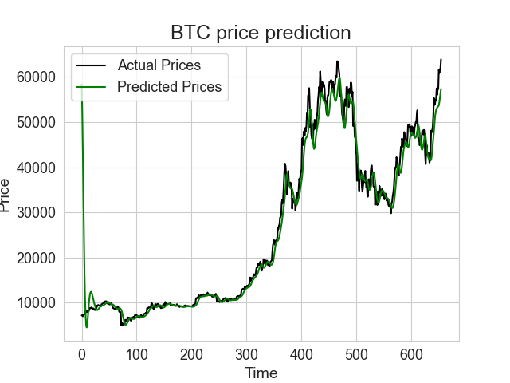

# crypto-price-predictor

Experimenting with cryptocurrency price predictions using sequential models and LSTM.



### Prediction script

src/predict.py is a script that generates a prediction of a crypto price against the USD value as specified in the script. When run, it will generate a prediction chart and the next day prediction for the prices.

How to run it:

```zsh
python src/predict.py
```

### Telegram bot

src/telegram-bot.py is a Telegram bot that connects to the Telegram API and allows users to send a command to a group to start the predictions of the pricing for the following day.

How to run it:

```zsh
python src/telegram-bot.py
```

Remember to add the Telegram bot token to a .env file as well.
